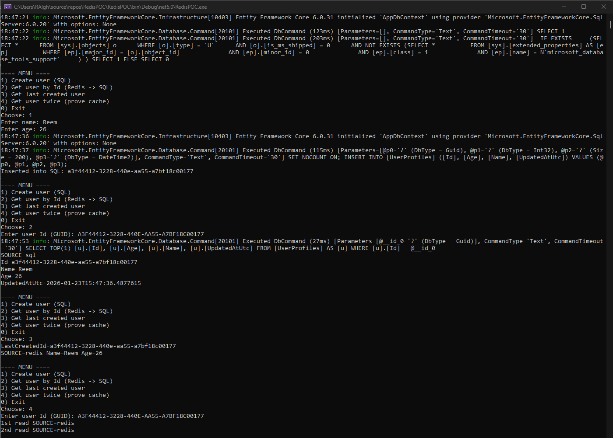
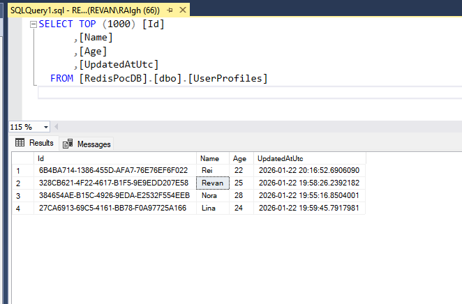

# Redis + EF Core + SQL Server Console POC (.NET 6)

Console application that stores users in **SQL Server** and uses **Redis** as a cache for reads (cache-aside pattern).
---

## What this project demonstrates

- SQL Server is the **source of truth** (durable data).
- Redis is a **cache** (fast key/value lookups).
- Reads use **cache-aside**:
  1) Try Redis (`GET key`)
  2) If miss → read SQL
  3) Store in Redis (`SET key value TTL`)
  4) Return result

Redis stores:
- **Key**: `userprofile:v1:{guid}`
- **Value**: JSON string for the user
- **TTL**: configured expiration (seconds)

---

## Project structure

- `Program.cs`  
  Host setup, dependency injection, starts the menu app.
- `App.cs`  
  Console menu (Create / Get / Get Twice / Exit).
- `Models/UserProfile.cs`  
  Entity model.
- `Data/AppDbContext.cs`  
  EF Core DbContext + mapping.
- `Data/UserRepository.cs`  
  Insert/Get operations for SQL.
- `Services/IRedisCacheService.cs`, `Services/RedisCacheService.cs`  
  All Redis access (connect, GET, SET).
- `Services/UserService.cs`  
  Cache-aside logic (Redis → SQL → Redis).
- `appsettings.json`  
  SQL Server and Redis configuration.

---

## Prerequisites

### .NET 6 SDK

### SQL Server

### Redis
Docker installed:
```bash
docker run --name redis-poc -p 6379:6379 -d redis:7-alpine
```

Where the Redis image comes from:
- `redis:7-alpine` is the official Redis image pulled from Docker Hub when not present locally.

---

## Configuration

`appsettings.json` example:

```json
{
  "ConnectionStrings": {
    "SqlServer": "Server=.\\SQLEXPRESS;Database=RedisPocDB;Trusted_Connection=True;TrustServerCertificate=True;"
  },
  "Redis": {
    "ConnectionString": "localhost:6379",
    "TtlSeconds": 600,
    "KeyPrefix": "userprofile:v1:"
  }
}
```

Notes:
- `TtlSeconds` controls how long cached entries remain in Redis.
- `KeyPrefix` defines the key namespace and version (`v1`).

---

## Run

Menu options:
- **Create user (SQL)**: prompts for Name/Age and inserts into SQL.
- **Get user (Redis -> SQL)**: tries Redis first; on miss reads SQL and caches.
- **Get user twice (prove cache)**: first read likely `sql`, second read should be `redis` if Redis is running.
- **Exit**: closes the app.

---

[](images/Console.png)

---

## Verify Redis (Redis side)

Redis is running in Docker:
```bash
docker exec -it redis-poc redis-cli
```

Inside `redis-cli`:

Watch commands live:
```redis
MONITOR
```
---

[](images/Redis.png)

[](images/SQL.png)

---

## Notes

- This is a POC. It uses `EnsureCreated()` to create schema (no migrations).
- Redis failures are treated as non-fatal; the app falls back to SQL.